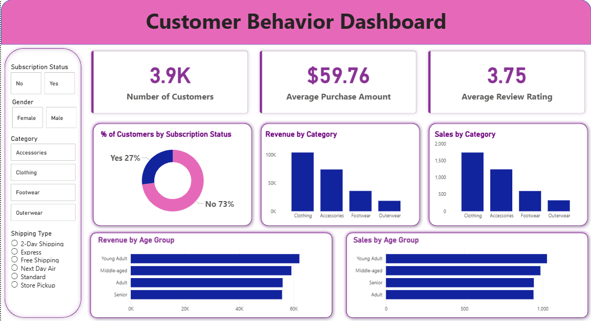

# Customer Shopping Behavior Analysis

## Overview
Analyzed 3,900+ customer shopping transactions using Python, PostgreSQL, and Power BI to uncover insights into customer behavior, spending patterns, subscriptions, discounts, and product performance.

## Tools & Technologies
- Python (Pandas, NumPy, Matplotlib)
- PostgreSQL
- Power BI

## Key Analysis
- Customer Segmentation
- Revenue & Sales Analysis
- Subscription Insights
- Discount Impact Analysis
- Product Performance Trends

## Project Highlights
- Cleaned and transformed raw transactional data using Python
- Performed SQL-based business analysis in PostgreSQL
- Built an interactive Power BI dashboard for visualization
- Generated actionable business recommendations

## Dashboard Preview

## Author
**Sanskar Gadhe**
